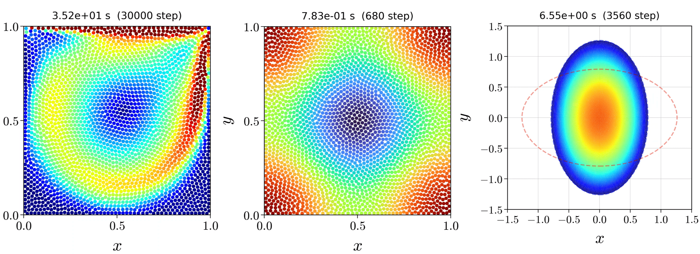

<div align="center">

# LS-SPH-Benchmarks <!-- omit in toc -->

<p align="center">
  高精度な粒子法「<strong>最小二乗SPH (Least-Squares SPH; LS-SPH) 法</strong>」によるベンチマークプログラム集
</p>



<br>

[](https://doi.org/10.5281/zenodo.19181862)
[](https://opensource.org/licenses/MIT)
[]()
[]()
[]()

[**View in English**](README.md)

</div>


## 目次 <!-- omit in toc -->
- [🔥 実装されているベンチマークテスト (全て2次元)](#-実装されているベンチマークテスト-全て2次元)
- [⚙️ 動作環境](#️-動作環境)
- [🖥️ 使い方](#️-使い方)
  - [1. 本リポジトリの取得](#1-本リポジトリの取得)
  - [2. 計算の実行](#2-計算の実行)
  - [3. 結果の可視化](#3-結果の可視化)
- [📖 マニュアル](#-マニュアル)
- [📁 ディレクトリ構造](#-ディレクトリ構造)
- [🧑‍💻 本プログラムを利用される場合](#-本プログラムを利用される場合)
- [🪪 ライセンス](#-ライセンス)

<br>

## 🔥 実装されているベンチマークテスト (全て2次元)

- **Verification**: 解析解との比較
  - 拡散方程式テスト
  - Taylor–Green渦
- **Validation**: 流体ベンチマークテスト
  - キャビティ流れ
  - ブシネスク対流


<!-- | Taylor–Green vortex | Lid-driven cavity flow | Boussinesq convection |
| :---: | :---: | :---: |
|  |  |  | -->

<br>

## ⚙️ 動作環境

SPH計算には **Fortran** (Intel Fortran / GNU gfortranに対応)，解析および可視化には **Python** を使用しています．

| カテゴリ | 必要な環境 | メモ |
| :--- | :--- | :--- |
| **OS** | Unix系環境 | テスト環境：Windows Subsystem for Linux (WSL) |
| **コンパイラ** | Intel Fortran / GNU gfortran | テスト環境：`ifx` (デフォルト) と `gfortran` |
| **ライブラリ** | MKL or LAPACK/BLAS | LS-SPHソルバーの行列演算に利用 |
| **ビルド** | Make | Fortranファイルのコンパイルに利用 |
| **可視化** | Python | テスト環境：`Python 3.12.0` |

> [!TIP]
> - **WSLの導入** や **WSL上へのIntel Fortran/Python環境の構築** に関するQiita記事を執筆しましたので，適宜ご参照ください．
>     - [WSL2のインストールとアンインストール](https://qiita.com/zakoken/items/61141df6aeae9e3f8e36)
>     - [WSL2によるgfortranとintel fortranの環境構築](https://qiita.com/zakoken/items/2a5e629020ce68f3efe1)
>     - [WSL2によるPython3の環境構築](https://qiita.com/zakoken/items/8ddfda7267e7d95b3c46)
> 
> - `gfortran` を使用する場合は，LAPACK と BLAS がインストールされていることをご確認ください
> - インストールされていない場合は `sudo apt install liblapack-dev libblas-dev` を実行してください

<br>


## 🖥️ 使い方

### 1. 本リポジトリの取得
- ターミナルで `git clone` コマンドを実行するか，ZIPファイルとして本プログラム全体をローカル環境（お使いのPCなど）にダウンロードし展開してください．

### 2. 計算の実行
1. 解く問題，ソルバーの種類，パラメータ値を [config.h](/config.h) で設定してください
2. ルートディレクトリ上で `make` を実行し，Fortranファイルをコンパイルしてください
3. ルートディレクトリ上で `./start_calculation` を実行してください（SPH計算が起動します）

> [!NOTE]
> - 計算結果（バイナリファイル）は自動的に `results/` ディレクトリに保存されます
> - 実装されているベンチマークテストおよびパラメータの推奨値は [materials/documents/benchmarks_detail.md](/materials/documents/benchmarks_detail.md) をご参照ください
> - [config.h](config.h) 内のパラメータの説明は [materials/documents/config_guide.md](/materials/documents/config_guide.md) をご参照ください
  
### 3. 結果の可視化
- Python スクリプトを実行する前に，専用の仮想環境を設定し，必要なライブラリをインストールしてください．
  1. 仮想環境を作成し有効化する
      ```bash
      python3 -m venv .venv
      source .venv/bin/activate
      ```
  2. 必要なライブラリをインストールする
      ```bash
      pip install --upgrade pip
      pip install -r requirements.txt
      ```
- [analyze.py](/analyze.py) の `SAVE_NAME` やその他の変数値を設定し，以下を実行してください
    ```bash
    python analyze.py
    ```

> [!NOTE]
> - 出力された図や動画は自動的に `figures/` ディレクトリに保存されます
> - 仮想環境から抜け出すためには，ターミナルで `deactivate` を実行してください

<br>

## 📖 マニュアル

[materials/documents/](/materials/documents/) ディレクトリ内に以下のマニュアルを用意しています．

- **[benchmarks_detail.md](/materials/documents/benchmarks_detail.md)**: 実装されているベンチマークテストの概要やパラメータの推奨値に関するマニュアル
- **[config_guide.md](/materials/documents/config_guide.md)**: 設定ファイル ([config.h](/config.h)) 内の各種パラメータの意味と使い方に関するマニュアル
- **[theory_manual.pdf](/materials/documents/theory_manual.pdf)**: 離散化手法，実装されているアルゴリズム，ベンチマークテストの解析解に関する理論マニュアル

<br>

## 📁 ディレクトリ構造

```
LS-SPH-Benchmarks/
├── analysis/              # Python解析コード
│   ├── benchmarks/        # 各ベンチマークの解析スクリプト
│   └── common/            # 解析ツール
├── materials/             # プロジェクト関連資料
│   ├── documents/         # 解説書など
│   └── images/            # README用画像など
├── source/                # Fortranソースコード
│   ├── boundary/          # 境界処理
│   ├── check/             # エラーチェック
│   ├── core/              # 構造体の定義およびSPHで用いるカーネル関数
│   ├── equation/          # 支配方程式と時間積分
│   ├── io/                # 入出力サブルーチン
│   ├── neighbor/          # 近傍粒子探索
│   ├── setup/             # 初期設定
│   ├── shifting/          # 粒子再配列法
│   └── main.f90           # メインプログラム
├── .gitignore             # Gitで無視するファイルの指示書
├── analyze.py             # メイン解析スクリプト
├── CHANGELOG.md           # バージョン履歴
├── CITATION.cff           # 引用情報
├── config.h               # 設定ファイル
├── initialize.py          # 初期化スクリプト
├── LICENSE                # ライセンス
├── Makefile               # コンパイル指令書
├── README.md              # 本ドキュメント（英語）
├── README_ja.md           # 本ドキュメント（日本語）
└── requirements.txt       # Python外部ライブラリ
```

> [!NOTE]
> プログラムのコンパイルおよび実行に伴い，中間バイナリファイルを格納する `build/`，計算データを出力する `results/`，画像や動画を保存する `figures/` ディレクトリが**自動的に**生成されます．

> [!Tip]
> 各プログラムファイルの使い方や詳細は `materials/documents` をご覧ください．

<br>

## 🧑‍💻 本プログラムを利用される場合

本リポジトリを利用される際は，以下の**2つの文献**を引用してください．

**[1] 論文**<br>
Shobuzako, K., Yoshida, S., Kawada, Y., Nakashima, R., Fujioka, S., & Asai, M. (2025).  
A generalized smoothed particle hydrodynamics method based on the moving least squares method and its discretization error estimation.  
*Results in Applied Mathematics*, 26, 100594. [https://doi.org/10.1016/j.rinam.2025.100594](https://doi.org/10.1016/j.rinam.2025.100594)  
DOI: 10.1016/j.rinam.2025.100594

**[2] ソフトウェア**<br>
Shobuzako, K. (2025). *LS-SPH-Benchmarks* (Version 1.0.0) [Computer software]. Zenodo.  
[https://doi.org/10.5281/zenodo.19181862](https://doi.org/10.5281/zenodo.19181862)

<details>
<summary>📄 BibTeX を表示（クリックして展開）</summary>

```bibtex
@article{shobuzako_2025_paper,
  author = {Kensuke Shobuzako and Shigeo Yoshida and Yoshifumi Kawada and Ryosuke Nakashima and Shujiro Fujioka and Mitsuteru Asai},
  title = {A generalized smoothed particle hydrodynamics method based on the moving least squares method and its discretization error estimation},
  journal = {Results in Applied Mathematics},
  volume = {26},
  pages = {100594},
  year = {2025},
  issn = {2590-0374},
  doi = {10.1016/j.rinam.2025.100594},
  url = {https://doi.org/10.1016/j.rinam.2025.100594}
}

@software{shobuzako_2025_software,
  author       = {Shobuzako, K.},
  title        = {LS-SPH-Benchmarks},
  year         = {2025},
  publisher    = {Zenodo},
  version      = {v1.0.0},
  doi          = {10.5281/zenodo.19181862},
  url          = {https://doi.org/10.5281/zenodo.19181862}
}
```
</details>

<br>

## 🪪 ライセンス

本リポジトリは [MITライセンス](LICENSE) に準拠しています．
